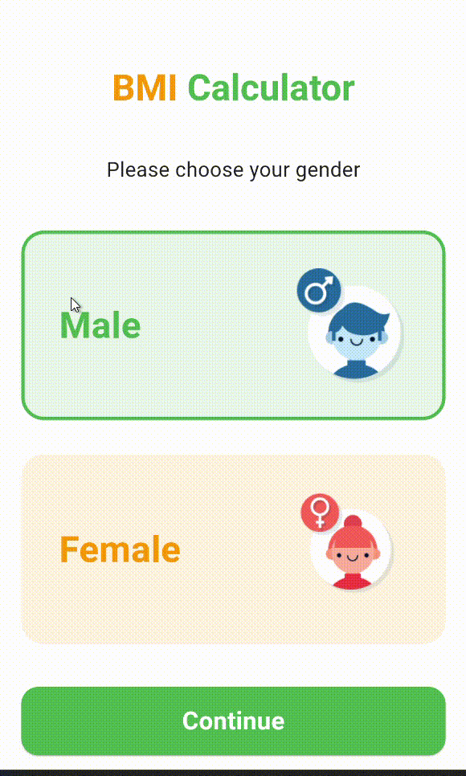
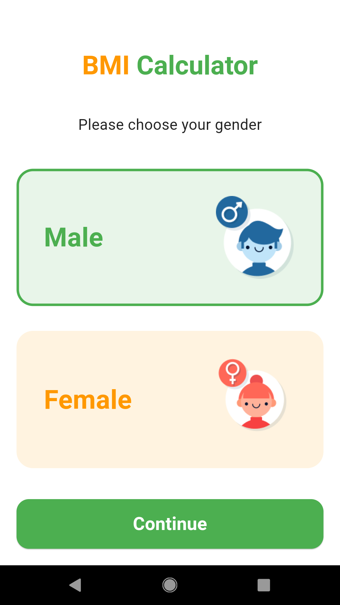
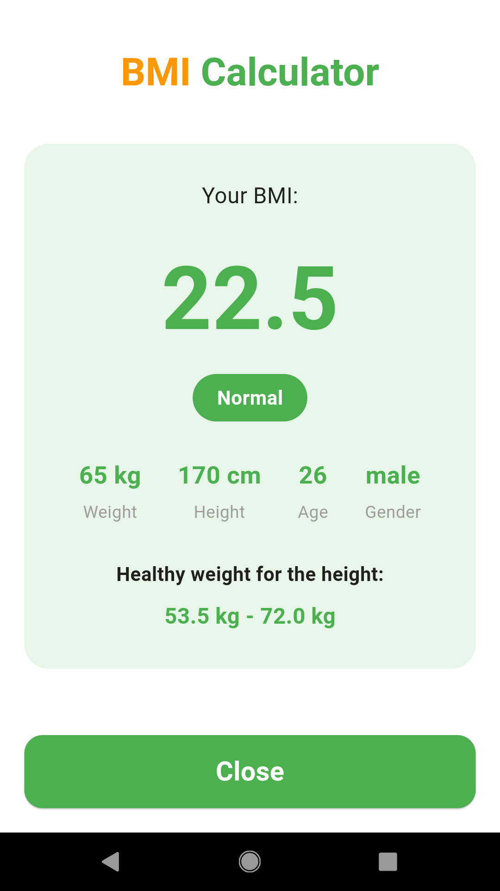

# 💪 BMI Calculator - Smart Health Tracker

<div align="center">


**Your Personal Health Companion for BMI Tracking and Analysis**

A modern Flutter mobile application that helps users calculate their Body Mass Index (BMI) with an intuitive interface, personalized health insights, and beautiful animations.

[](https://flutter.dev)
[](https://dart.dev)
[](LICENSE)
[](https://github.com/AserAbdo/BMI2)

[📖 Docs](#table-of-contents) • [🚀 Quick Start](#-quick-start) • [💡 Features](#-key-features) • [🤝 Contribute](#-contributing)

</div>

---

## 📋 Table of Contents

- [Demo](#-demo)
- [Key Features](#-key-features)
- [Screenshots](#-screenshots)
- [Project Structure](#-project-structure)
- [Architecture](#-architecture)
- [Tech Stack](#-tech-stack)
- [Requirements](#-requirements)
- [Quick Start](#-quick-start)
- [Building](#-building)
- [Testing](#-tests)
- [Contributing](#-contributing)
- [License](#-license)
- [Support](#-support)

---

## 🎬 Demo

Watch the app in action:

<div align="center">



**BMI Calculator Demo — Calculate Your Health Index**

</div>

---

## ✨ Key Features

- 📱 **Cross-Platform** — Works seamlessly on iOS and Android
- 🎨 **Beautiful UI** — Modern design with smooth animations
- 👥 **Gender Selection** — Personalized calculations for male and female
- ⚖️ **Weight Tracking** — Easy weight input with increment/decrement controls
- 📏 **Height Slider** — Interactive slider for precise height selection
- 🎂 **Age Input** — Simple age tracking for accurate results
- 📊 **BMI Categories** — Clear categorization (Underweight, Normal, Overweight, Obese)
- 🎯 **Health Insights** — Shows healthy weight range for your height
- 🔢 **Real-Time Calculation** — Instant BMI results with category color coding
- 🏗️ **Feature-Layered Architecture** — Clean, maintainable, and scalable code structure
- 📲 **Responsive Design** — Adapts to all screen sizes with scrollable content
- ♿ **Accessible** — User-friendly interface for all users

---

## 📸 Screenshots

### Core Screens

|                             **Gender Selection**                              |                             **BMI Input**                             |                             **BMI Result**                              |
| :---------------------------------------------------------------------------: | :-------------------------------------------------------------------: | :---------------------------------------------------------------------: |
|  |  |  |
|                              Choose your gender                               |                      Input weight, age & height                       |                          View your BMI results                          |

### UI Highlights

- 🟢 **Green Theme** for healthy & normal BMI
- 🟠 **Orange Theme** for overweight category
- 🔵 **Blue Theme** for underweight category
- 🔴 **Red Theme** for obese category

---

## 🏗 Project Structure

```
lib/
├── main.dart                                    # ⚡ Entry point
├── core/                                        # 🎯 Shared/common code
│   ├── utils/
│   │   ├── bmi_calculator.dart                 # 🧮 BMI calculation logic
│   │   └── colors.dart                         # 🎨 App color constants
│   └── widgets/
│       ├── app_title.dart                      # 📝 Reusable title widget
│       └── primary_button.dart                 # 🔘 Reusable button widget
├── features/                                    # 📦 Feature modules
│   ├── gender_selection/
│   │   └── presentation/
│   │       ├── gender_selection_screen.dart    # 👥 Gender selection UI
│   │       └── widgets/
│   │           └── gender_card.dart            # 🎴 Gender card widget
│   ├── bmi_input/
│   │   └── presentation/
│   │       ├── bmi_input_screen.dart           # 📝 BMI input UI
│   │       └── widgets/
│   │           ├── value_card.dart             # 🔢 Value input widget
│   │           └── height_slider_card.dart     # 📏 Height slider widget
│   └── bmi_result/
│       └── presentation/
│           ├── bmi_result_screen.dart          # 📊 Result display UI
│           └── widgets/
│               └── bmi_result_card.dart        # 📈 Result card widget
└── assets/                                      # 🖼️ Images and media
    ├── male.png                                 # 👨 Male icon
    └── female.png                               # 👩 Female icon
```

---

## 🏛 Architecture

This project follows a **Feature-Layered Architecture** pattern:

### Benefits

✅ **Separation of Concerns** — Each feature is isolated and independent  
✅ **Scalability** — Easy to add new features without affecting existing code  
✅ **Maintainability** — Clear structure makes code easy to understand and modify  
✅ **Reusability** — Common widgets and utilities are shared across features  
✅ **Testability** — Easy to write unit and widget tests for isolated components

### Layers

- **Core Layer** — Shared utilities, widgets, and constants
- **Features Layer** — Independent feature modules (gender selection, BMI input, results)
- **Presentation Layer** — UI screens and widgets

---

## 🛠 Tech Stack

### Framework & Language

| Component   | Version | Purpose                  |
| ----------- | ------- | ------------------------ |
| **Flutter** | 3.10+   | Cross-platform framework |
| **Dart**    | 3.10+   | Programming language     |

### Core Libraries

| Library       | Version  | Purpose                    |
| ------------- | -------- | -------------------------- |
| **Material**  | Built-in | Material Design components |
| **Cupertino** | Built-in | iOS-style widgets          |

### Design Patterns

- **Feature-Layered Architecture** — Organized by features
- **Widget Composition** — Reusable UI components
- **State Management** — StatefulWidget for local state

---

## 🔧 Requirements

| Requirement     | Version | Notes                                                           |
| --------------- | ------- | --------------------------------------------------------------- |
| **Flutter SDK** | 3.10+   | [Install Flutter](https://flutter.dev/docs/get-started/install) |
| **Dart SDK**    | 3.10+   | Included with Flutter                                           |
| **Android**     | API 21+ | Android 5.0 and above                                           |
| **iOS**         | 12.0+   | Xcode 13+                                                       |

### Optional

- **Android Studio** or **VS Code** (recommended IDEs)
- **Git** (for cloning the repository)

---

## 🚀 Quick Start

### Step 1️⃣ — Clone the Repository

```bash
git clone https://github.com/AserAbdo/BMI2.git
cd BMI2
```

### Step 2️⃣ — Install Dependencies

```bash
flutter pub get
```

### Step 3️⃣ — Run the App

```bash
# Development mode
flutter run

# Release mode (Android)
flutter run --release

# Release mode (iOS, macOS only)
flutter run -d "iPhone" --release
```

### 🔗 Useful Commands

```bash
# Clean build
flutter clean && flutter pub get

# Check for issues
dart analyze

# Format code
dart format .

# Fix code issues
dart fix --apply
```

---

## 📦 Building

### Android

```bash
# Debug APK
flutter build apk --debug

# Release APK (unsigned)
flutter build apk --release

# App Bundle for Google Play (recommended)
flutter build appbundle --release
```

### iOS (requires macOS)

```bash
# Debug build
flutter build ios --debug

# Release build (IPA)
flutter build ipa --release
```

### 📍 Output Locations

- Android APK: `build/app/outputs/flutter-apk/`
- Android Bundle: `build/app/outputs/bundle/`
- iOS IPA: `build/ios/ipa/`

---

## 🧪 Tests

### Run All Tests

```bash
flutter test
```

### Run Specific Test File

```bash
flutter test test/path/to/test_file.dart
```

### Run with Coverage

```bash
# Generate coverage report
flutter test --coverage

# View coverage (requires lcov)
lcov --list coverage/lcov.info
```

### Run Tests in Release Mode

```bash
flutter test --release
```

---

## 📐 BMI Calculation Formula

The BMI is calculated using the standard formula:

```
BMI = weight (kg) / [height (m)]²
```

### BMI Categories

| BMI Range      | Category    | Color Indicator |
| -------------- | ----------- | --------------- |
| Below 18.5     | Underweight | 🔵 Blue         |
| 18.5 - 24.9    | Normal      | 🟢 Green        |
| 25.0 - 29.9    | Overweight  | 🟠 Orange       |
| 30.0 and above | Obese       | 🔴 Red          |

---

## 🤝 Contributing

We ❤️ contributions! Whether it's bug fixes, new features, or documentation improvements, all contributions are welcome.

### How to Contribute

1. **Fork** the repository
2. **Create** a feature branch:
   ```bash
   git checkout -b feature/amazing-feature
   ```
3. **Make** your changes and commit:
   ```bash
   git commit -m "feat: add amazing feature"
   ```
4. **Push** to your branch:
   ```bash
   git push origin feature/amazing-feature
   ```
5. **Open** a Pull Request with a clear description

### Code Standards

- ✅ Run `dart format .` before committing
- ✅ Ensure `dart analyze` passes
- ✅ Add tests for new features
- ✅ Update documentation if needed
- ✅ Follow [Dart Style Guide](https://dart.dev/guides/language/effective-dart/style)
- ✅ Use feature-layered architecture pattern

### Commit Message Format

```
<type>: <subject>

<body>

<footer>
```

**Types:** `feat`, `fix`, `docs`, `style`, `refactor`, `test`, `chore`

**Example:**

```
feat: add BMI history tracking feature
```

---

## 📄 License

This project is licensed under the **MIT License**.

See the [LICENSE](LICENSE) file for full details.

```
MIT License

Copyright (c) 2025 AserAbdo

Permission is hereby granted, free of charge, to any person obtaining a copy...
```

---

## 👨‍💻 Author & Support

### Created by

**[AserAbdo](https://github.com/AserAbdo)**  
📧 Email: aserabdocontact@gmail.com  
🌐 Portfolio: [https://aserabdo.github.io/portfolio](https://aserabdo.github.io/portfolio)

### Get Help

- 📖 **Documentation:** Check the [Wiki](../../wiki)
- 🐛 **Report Bugs:** [Open an Issue](../../issues/new?template=bug_report.md)
- 💡 **Feature Request:** [Request Feature](../../issues/new?template=feature_request.md)
- 💬 **Discussions:** [Start Discussion](../../discussions)

### Useful Links

- [Flutter Docs](https://flutter.dev/docs)
- [Dart Docs](https://dart.dev)
- [Material Design](https://material.io/design)
- [BMI Information (WHO)](https://www.who.int/news-room/fact-sheets/detail/obesity-and-overweight)

---

## 🙏 Acknowledgments

- 🙌 [Flutter Team](https://flutter.dev) for the amazing framework
- 💪 Health organizations for BMI standards and guidelines
- 🎨 Design inspiration from modern health apps
- 👥 All contributors and the community

---

## 🔮 Future Features

- [ ] BMI History tracking
- [ ] Weight goal setting
- [ ] Health tips and recommendations
- [ ] Multi-language support
- [ ] Dark mode theme
- [ ] Export results as PDF
- [ ] Share results on social media
- [ ] Integration with fitness apps
- [ ] Metric/Imperial unit toggle

---

<div align="center">

**[⬆ Back to Top](#-bmi-calculator---smart-health-tracker)**

Made with ❤️ by [AserAbdo](https://github.com/AserAbdo)

**If you find this project helpful, please give it a ⭐ on GitHub!**

</div>
